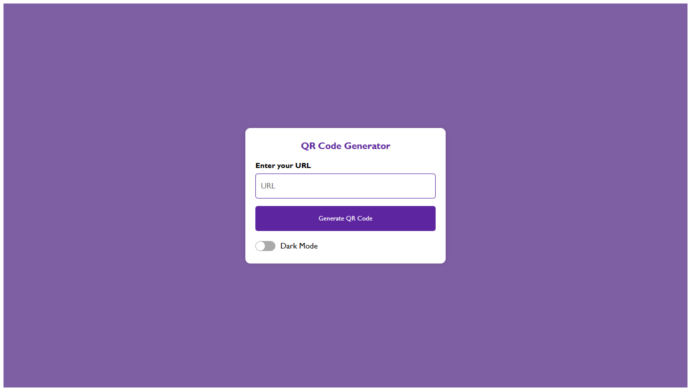
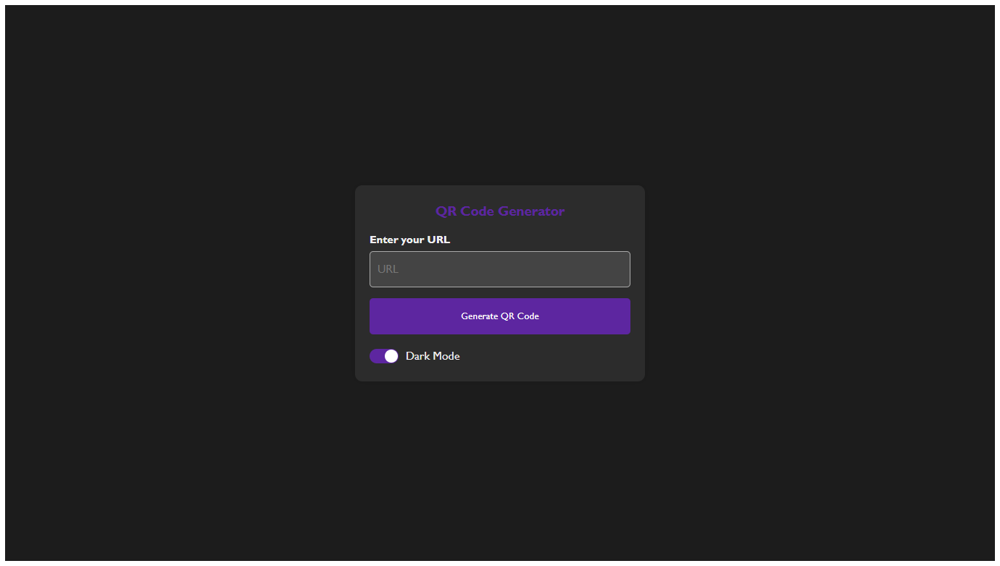

# QR Code Generator

Hey! This is a cute, clean, and mobile-friendly QR Code Generator I built using pure HTML, CSS, and JavaScript. It lets you create QR codes from any link or text, choose the color and size, switch between light and dark mode, and even download your generated code as an image. Oh — and it looks great on your phone too!

---

## 🌟 Features

- 🔗 Generate QR codes from any text or link
- 🌙 Dark mode toggle (because everything’s better in dark mode)
- 📱 Responsive layout — works beautifully on mobile
- ⚠️ Fun little shake animation if you try to generate with an empty field

---

## 🛠️ Technologies

- HTML5
- CSS3 (custom styles, responsive + dark mode)
- JavaScript (vanilla, no libraries)

---

## 📂 Files

qr-code-generator/
├── index.html           ← Main structure
├── style.css            ← All styles (light, dark, responsive)
├── script.js            ← Core logic for QR generation & features
├── LICENSE              ← Project license
├── README.md            ← This file!
└── screenshots/         ← Folder with screenshots of preview images
    └── preview_dark.png      
    └── preview_light.png


---

## 🚀 How to Use

1. Clone or download the project:
   ```bash
   git clone https://github.com/maysa42snow/qr-code-generator.git
2. Open index.html in your browser.
3. Type a URL or any text in the input box.
4. Click "Generate QR Code".
5. Want it dark? Toggle Dark Mode at the bottom 🌙

---

## 📸 Preview

Light Mode

Dark Mode
 <!-- Replace with your actual screenshot path -->

---

## 📱 Mobile View 

This little app adjusts itself for mobile — buttons get bigger, text stays readable, and everything fits in place. No pinching or zooming needed 💜

---

## 🧠 Ideas for later (if I feel like it)

- Download as SVG
- Recently generated history
- Option to share directly to other apps

---

## 📄 License

Feel free to use, remix, or build on this!
Licensed under the MIT License.

---

Made with a bit of chaos, and a lot of love 💜  
— maysa42snow
